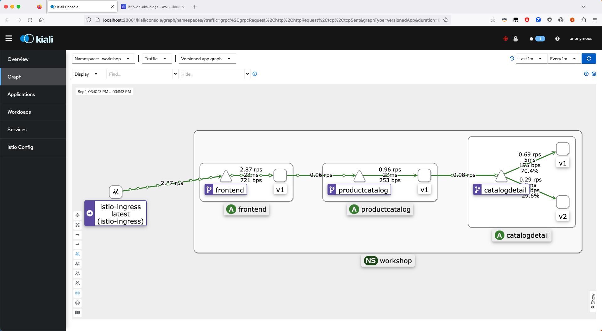

# Module 2 - Traffic Management
## Section 4 - Shift traffic to v2 based on header

In this step we shift traffic to the `catalogdetail` service based on a `user-type` custom header.
The header is set on the fly through an [`EnvoyFilter`](https://istio.io/latest/docs/reference/config/networking/envoy-filter/)
applied on [`productcatalog`](./productcatalog-envoyfilter.yaml) sidecar proxy. The filter installs an outbound request listener that sets the `user-type` header randomly 30% of the time to the value `internal`. Otherwise it sets the header to the value `external`.

### Deploy

```bash
# Change directory to the right folder
cd ../04-shift-traffic-v2-header

# Update route to add a match on user-type header
# and install a filter to set the header
kubectl apply -f '*.yaml'
```

Output should be similar to:
```bash
virtualservice.networking.istio.io/catalogdetail configured
envoyfilter.networking.istio.io/productcatalog created
```

### Validate

#### Istio Resources

Run the following command to describe the [`catalogdetail`](./catalogdetail-virtualservice.yaml) `VirtualService`.

```bash
kubectl describe VirtualService catalogdetail -n workshop
```

Output should be similar to:
```bash
Name:         catalogdetail
Namespace:    workshop
Labels:       <none>
Annotations:  <none>
API Version:  networking.istio.io/v1beta1
Kind:         VirtualService
Metadata:
  Creation Timestamp:  2023-09-01T11:23:51Z
  Generation:          4
  Resource Version:    401676
  UID:                 651d4441-2db9-45f6-b0b8-ebbe76855c74
Spec:
  Hosts:
    catalogdetail
  Http:
    Match:
      Headers:
        User - Type:
          Exact:  internal
    Route:
      Destination:
        Host:  catalogdetail
        Port:
          Number:  3000
        Subset:    v2
    Route:
      Destination:
        Host:  catalogdetail
        Port:
          Number:  3000
        Subset:    v1
Events:            <none>
```

Run the following command to describe the [`productcatalog`](./productcatalog-envoyfilter.yaml) `EnvoyFilter`.
```bash
kubectl describe EnvoyFilter productcatalog -n workshop
```

Output should be similar to:
```bash
Name:         productcatalog
Namespace:    workshop
Labels:       <none>
Annotations:  <none>
API Version:  networking.istio.io/v1alpha3
Kind:         EnvoyFilter
Metadata:
  Creation Timestamp:  2023-09-01T14:17:00Z
  Generation:          1
  Resource Version:    405354
  UID:                 9a94cd73-b660-4e06-ab5f-87632b65ea56
Spec:
  Config Patches:
    Apply To:  HTTP_FILTER
    Match:
      Context:  SIDECAR_OUTBOUND
      Listener:
        Filter Chain:
          Filter:
            Name:  envoy.filters.network.http_connection_manager
            Sub Filter:
              Name:  envoy.filters.http.router
    Patch:
      Operation:  INSERT_BEFORE
      Value:
        Name:  envoy.filters.http.lua
        typed_config:
          @type:        type.googleapis.com/envoy.extensions.filters.http.lua.v3.Lua
          Inline Code:  function envoy_on_request(request_handle)
    math.randomseed(os.clock()*100000000000);
    local r = math.random(1, 100);
    if r <= 30 then
    request_handle:headers():add("USER-TYPE", "internal");
    else
    request_handle:headers():add("USER-TYPE", "external");
    end
end
  Workload Selector:
    Labels:
      App:  productcatalog
Events:     <none>
```

### Test

#### Generating Traffic

Use the `siege` command line tool, generate traffic to the HTTP endpoint 
`http://$ISTIO_INGRESS_URL` noted above in the deployment output by running the following
command in a separate terminal session.

```sh 
# Generate load for 2 minute, with 5 concurrent threads and with a delay of 10s
# between successive requests
siege http://$ISTIO_INGRESS_URL -c 5 -d 10 -t 2M
```

While the load is being generated access the `kiali` console you previously 
configured and you should notice the traffic to be flowing in the manner shown
below:



The traffic distribution for `catalogdetail` shows almost 70% is routed to `v1` version and approximately 30% is routed to `v2` version.

### Destroy