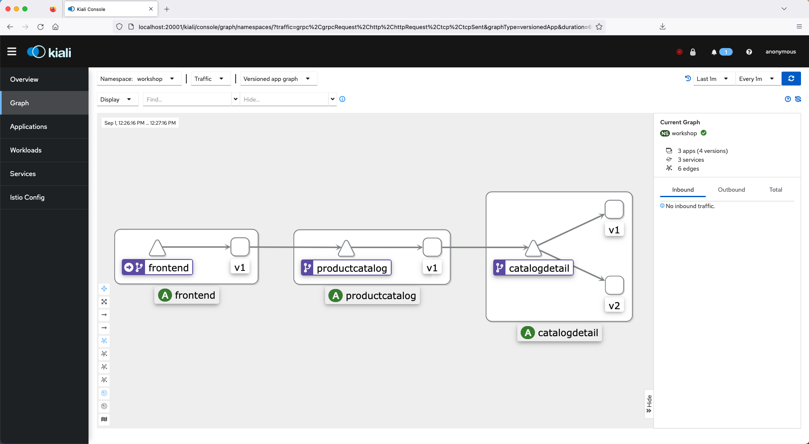
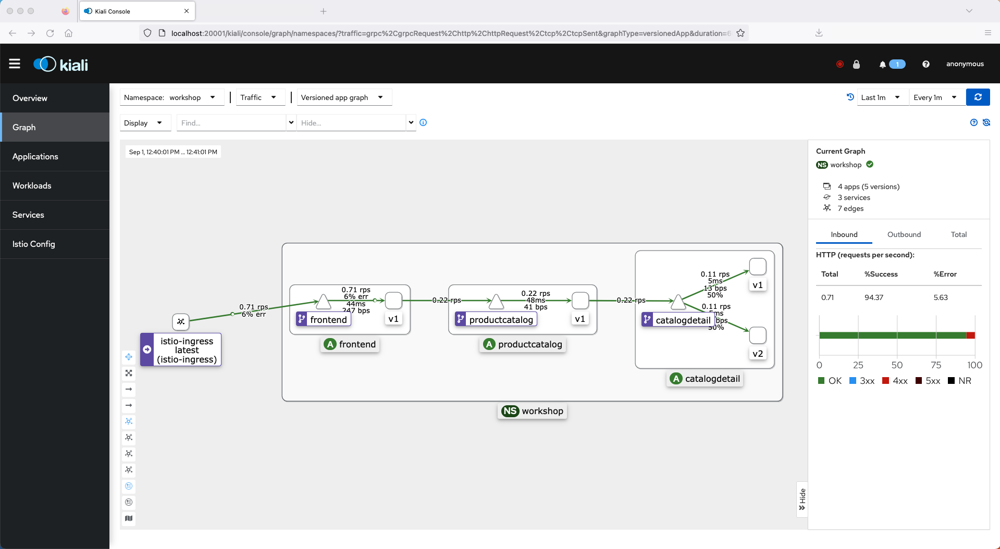
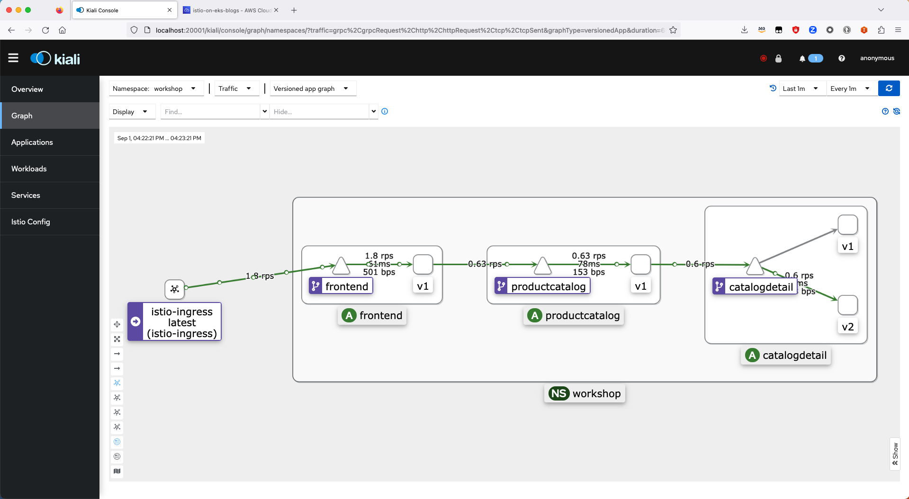

# Module 2 - Traffic Management

This module shows the traffic routing capabilities of Istio service-mesh on Amazon EKS. The module is split into subdirectories for different traffic routing/shifting use cases.

## Prerequisites:
- [Module 1 - Getting Started](../01-getting-started/)

Note: This module will build on the application resources deployed in 
[Module 1 - Getting Started](../01-getting-started/). That means you **don't** have to execute the [Destroy](../01-getting-started/README.md#destroy) section in Module 1.

## Initial state setup

In this step we add the Istio mesh resources to wrap the `frontend`, `productcatalog` and
`catalogdetail` services.

A [`DestinationRule`](https://istio.io/latest/docs/reference/config/networking/destination-rule/) is created for [`catalogdetail`](./setup-mesh-resources/catalogdetail-destinationrule.yaml) to select subsets
based on the `version` label of the destination pods. However, the initial [`VirtualService`](./setup-mesh-resources/catalogdetail-virtualservice.yaml) definition does not specify any 
subset configuration thereby leading to a uniform traffic spread across both subsets.

### Deploy 

```bash
# Change directory to the right folder
cd ../02-traffic-management

# Install the mesh resources
kubectl apply -f ./setup-mesh-resources/
```

Output should be similar to:
```bash
destinationrule.networking.istio.io/catalogdetail created
virtualservice.networking.istio.io/catalogdetail created
virtualservice.networking.istio.io/frontend created
virtualservice.networking.istio.io/productcatalog created
```

### Validate

#### Istio Resources

Run the following command to list all the Istio resources created.

```bash
kubectl get Gateway,VirtualService,DestinationRule -n workshop
```

Output should be similar to:
```bash
NAME                                             AGE
gateway.networking.istio.io/productapp-gateway   25m

NAME                                                GATEWAYS                 HOSTS                AGE
virtualservice.networking.istio.io/catalogdetail                             ["catalogdetail"]    48s
virtualservice.networking.istio.io/frontend                                  ["frontend"]         48s
virtualservice.networking.istio.io/productapp       ["productapp-gateway"]   ["*"]                25m
virtualservice.networking.istio.io/productcatalog                            ["productcatalog"]   48s

NAME                                                HOST                                       AGE
destinationrule.networking.istio.io/catalogdetail   catalogdetail.workshop.svc.cluster.local   48s
```

Access the `kiali` console you previously configured in 
[Configure Kiali](../01-getting-started/README.md#configure-kiali) and you should notice
that the `frontend`, `productcatalog` and `catalogdetail` services now show up as `VirtualService` 
nodes.



### Test

#### Generating Traffic

Use the `siege` command line tool, generate traffic to the HTTP endpoint 
`http://$ISTIO_INGRESS_URL` noted above in the deployment output by running the following
command in a separate terminal session.

```sh 
# Generate load for 2 minute, with 5 concurrent threads and with a delay of 10s
# between successive requests
siege http://$ISTIO_INGRESS_URL -c 5 -d 10 -t 2M
```

While the load is being generated access the `kiali` console you previously 
configured and you should notice the traffic to be flowing in the manner shown
below:



The traffic distribution for `catalogdetail` shows almost even (50%) split between
both `v1` and `v2` versions like before.

## Setup default route to v1

In this step we setup default route for `catalogdetail` virtual service to 
route all traffic to `v1` version.

### Deploy

```bash
# Update route to add subset: v1
kubectl apply -f ./default-route-v1/catalogdetail-virtualservice.yaml
```

Output should be similar to:
```bash
virtualservice.networking.istio.io/catalogdetail configured
```

### Validate

#### Istio Resources

Run the following command to describe the [`catalogdetail`](./default-route-v1/catalogdetail-virtualservice.yaml) `VirtualService`.

```bash
kubectl describe VirtualService catalogdetail -n workshop
```

Output should be similar to:
```bash
Name:         catalogdetail
Namespace:    workshop
Labels:       <none>
Annotations:  <none>
API Version:  networking.istio.io/v1beta1
Kind:         VirtualService
Metadata:
  Creation Timestamp:  2023-09-01T11:23:51Z
  Generation:          2
  Resource Version:    379088
  UID:                 651d4441-2db9-45f6-b0b8-ebbe76855c74
Spec:
  Hosts:
    catalogdetail
  Http:
    Route:
      Destination:
        Host:  catalogdetail
        Port:
          Number:  3000
        Subset:    v1
Events:            <none>
```

### Test

#### Generating Traffic

Use the `siege` command line tool, generate traffic to the HTTP endpoint 
`http://$ISTIO_INGRESS_URL` noted above in the deployment output by running the following
command in a separate terminal session.

```sh 
# Generate load for 2 minute, with 5 concurrent threads and with a delay of 10s
# between successive requests
siege http://$ISTIO_INGRESS_URL -c 5 -d 10 -t 2M
```

While the load is being generated access the `kiali` console you previously 
configured and you should notice the traffic to be flowing in the manner shown
below:


The traffic distribution for `catalogdetail` shows all traffic is now routed
to only `v1` version.

### Revert to initial state

```bash
# Revert catalogdetail
kubectl apply -f ./setup-mesh-resources/catalogdetail-virtualservice.yaml
```

## Shift traffic to v2 based on weight

In this step we start shifting roughly 10% of traffic to `catalogdetail` virtual service to `v2` version.

### Deploy

```bash
# Update route to add 90% weight to subset: v1 and 10% weight to subset: v2
kubectl apply -f ./shift-traffic-v2-weight/catalogdetail-virtualservice.yaml
```

Output should be similar to:
```bash
virtualservice.networking.istio.io/catalogdetail configured
```

### Validate

#### Istio Resources

Run the following command to describe the [`catalogdetail`](./shift-traffic-v2-weight/catalogdetail-virtualservice.yaml) `VirtualService`.

```bash
kubectl describe VirtualService catalogdetail -n workshop
```

Output should be similar to:
```bash
Name:         catalogdetail
Namespace:    workshop
Labels:       <none>
Annotations:  <none>
API Version:  networking.istio.io/v1beta1
Kind:         VirtualService
Metadata:
  Creation Timestamp:  2023-09-01T11:23:51Z
  Generation:          3
  Resource Version:    396580
  UID:                 651d4441-2db9-45f6-b0b8-ebbe76855c74
Spec:
  Hosts:
    catalogdetail
  Http:
    Route:
      Destination:
        Host:  catalogdetail
        Port:
          Number:  3000
        Subset:    v1
      Weight:      90
      Destination:
        Host:  catalogdetail
        Port:
          Number:  3000
        Subset:    v2
      Weight:      10
Events:            <none>
```

### Test

#### Generating Traffic

Use the `siege` command line tool, generate traffic to the HTTP endpoint 
`http://$ISTIO_INGRESS_URL` noted above in the deployment output by running the following
command in a separate terminal session.

```sh 
# Generate load for 2 minute, with 5 concurrent threads and with a delay of 10s
# between successive requests
siege http://$ISTIO_INGRESS_URL -c 5 -d 10 -t 2M
```

While the load is being generated access the `kiali` console you previously 
configured and you should notice the traffic to be flowing in the manner shown
below:


The traffic distribution for `catalogdetail` shows almost 87% is randomly routed to `v1` version and only 13% is routed to `v2` version.

### Revert to initial state

```bash
# Revert catalogdetail
kubectl apply -f ./setup-mesh-resources/catalogdetail-virtualservice.yaml
```

## Shift traffic to v2 based on path

In this step we shift traffic to `v2` version of the `catalogdetail` service based on request URI path. The `productcatalog` service uses `AGG_APP_URL` environment variable to lookup and invoke the `catalogdetail` service. The environment variable is updated from

```
AGG_APP_URL=http://catalogdetail.workshop.svc.cluster.local:3000/catalogDetail
```

to

```
AGG_APP_URL=http://catalogdetail.workshop.svc.cluster.local:3000/v2/catalogDetail
```

The [`catalogdetail`](./shift-traffic-v2-path/catalogdetail-virtualservice.yaml) `VirtualService` is updated with an exact
URI path match on `/v2/catalogDetail` to route requests to `v2` subset. A URI rewrite rule reverts the
path from `/v2/catalogDetail` back to `/catalogDetail` before forwarding the request to the destination
pod.

### Deploy

```bash
# Update route to send requests to /v2/catalogdetail to version v2.
kubectl apply -f ./shift-traffic-v2-path/catalogdetail-virtualservice.yaml
```

Output should be similar to:
```bash
virtualservice.networking.istio.io/catalogdetail configured
```

Set the environment variable in `productcatalog` for `catalogdetail` service.

```bash
# Set service endpoint environment variable in productcatalog.
kubectl set env deployment/productcatalog -n workshop AGG_APP_URL=http://catalogdetail.workshop.svc.cluster.local:3000/v2/catalogDetail
```

Output should be similar to:
```bash
deployment.apps/productcatalog env updated
```

### Validate

Verify that the `productcatalog` deployment has rolled out a new pod with the new environment variable.

```bash
kubectl describe deployment/productcatalog -n workshop
```

Output should be similar to:
```bash
Name:                   productcatalog
Namespace:              workshop
CreationTimestamp:      Fri, 01 Sep 2023 11:59:30 +0100
Labels:                 app.kubernetes.io/managed-by=Helm
Annotations:            deployment.kubernetes.io/revision: 2
                        meta.helm.sh/release-name: mesh-basic
                        meta.helm.sh/release-namespace: workshop
Selector:               app=productcatalog,version=v1
Replicas:               1 desired | 1 updated | 1 total | 1 available | 0 unavailable
StrategyType:           RollingUpdate
MinReadySeconds:        0
RollingUpdateStrategy:  25% max unavailable, 25% max surge
Pod Template:
  Labels:           app=productcatalog
                    version=v1
  Annotations:      sidecar.opentelemetry.io/inject: true
  Service Account:  productcatalog-sa
  Containers:
   productcatalog:
    Image:      public.ecr.aws/u2g6w7p2/eks-workshop-demo/product_catalog:1.0
    Port:       5000/TCP
    Host Port:  0/TCP
    Liveness:   http-get http://:5000/products/ping delay=0s timeout=1s period=10s #success=1 #failure=3
    Readiness:  http-get http://:5000/products/ping delay=0s timeout=1s period=10s #success=3 #failure=3
    Environment:
      AGG_APP_URL:  http://catalogdetail.workshop.svc.cluster.local:3000/v2/catalogDetail
    Mounts:         <none>
  Volumes:          <none>
Conditions:
  Type           Status  Reason
  ----           ------  ------
  Available      True    MinimumReplicasAvailable
  Progressing    True    NewReplicaSetAvailable
OldReplicaSets:  productcatalog-5b79cb8dbb (0/0 replicas created)
NewReplicaSet:   productcatalog-69f56d4d8f (1/1 replicas created)
Events:
  Type    Reason             Age   From                   Message
  ----    ------             ----  ----                   -------
  Normal  ScalingReplicaSet  54s   deployment-controller  Scaled up replica set productcatalog-69f56d4d8f to 1
  Normal  ScalingReplicaSet  44s   deployment-controller  Scaled down replica set productcatalog-5b79cb8dbb to 0 from 1
```

#### Istio Resources

Run the following command to describe the [`catalogdetail`](./shift-traffic-v2-path/catalogdetail-virtualservice.yaml) `VirtualService`. Verify that the URI match and rewrite settings for `v2` are updated.

```bash
kubectl describe VirtualService catalogdetail -n workshop
```

Output should be similar to:
```bash
Name:         catalogdetail
Namespace:    workshop
Labels:       <none>
Annotations:  <none>
API Version:  networking.istio.io/v1beta1
Kind:         VirtualService
Metadata:
  Creation Timestamp:  2023-09-01T11:23:51Z
  Generation:          5
  Resource Version:    419539
  UID:                 651d4441-2db9-45f6-b0b8-ebbe76855c74
Spec:
  Hosts:
    catalogdetail
  Http:
    Match:
      Uri:
        Exact:  /v2/catalogDetail
    Rewrite:
      Uri:  /catalogDetail
    Route:
      Destination:
        Host:  catalogdetail
        Port:
          Number:  3000
        Subset:    v2
    Route:
      Destination:
        Host:  catalogdetail
        Port:
          Number:  3000
        Subset:    v1
Events:            <none>
```

### Test

#### Generating Traffic

Use the `siege` command line tool, generate traffic to the HTTP endpoint 
`http://$ISTIO_INGRESS_URL` noted above in the deployment output by running the following
command in a separate terminal session.

```sh 
# Generate load for 2 minute, with 5 concurrent threads and with a delay of 10s
# between successive requests
siege http://$ISTIO_INGRESS_URL -c 5 -d 10 -t 2M
```

While the load is being generated access the `kiali` console you previously 
configured and you should notice the traffic to be flowing in the manner shown
below:



The traffic distribution for `catalogdetail` shows 100% of requests are routed to `v2` version.

### Revert to initial state

```bash
# Revert env
kubectl set env deployment/productcatalog -n workshop AGG_APP_URL=http://catalogdetail.workshop.svc.cluster.local:3000/catalogDetail

# Revert catalogdetail
kubectl apply -f ./setup-mesh-resources/catalogdetail-virtualservice.yaml
```

## Shift traffic to v2 based on header

In this step we shift traffic to the `catalogdetail` service based on a `user-type` custom header.
The header is set on the fly through an [`EnvoyFilter`](https://istio.io/latest/docs/reference/config/networking/envoy-filter/)
applied on [`productcatalog`](./shift-traffic-v2-header/productcatalog-envoyfilter.yaml) sidecar proxy. The filter installs an outbound request listener that sets the `user-type` header randomly 30% of the time to the value `internal`. Otherwise it sets the header to the value `external`.

### Deploy

```bash
# Update route to add a match on user-type header
# and install a filter to set the header
kubectl apply -f ./shift-traffic-v2-header/
```

Output should be similar to:
```bash
virtualservice.networking.istio.io/catalogdetail configured
envoyfilter.networking.istio.io/productcatalog created
```

### Validate

#### Istio Resources

Run the following command to describe the [`catalogdetail`](./shift-traffic-v2-header/catalogdetail-virtualservice.yaml) `VirtualService`.

```bash
kubectl describe VirtualService catalogdetail -n workshop
```

Output should be similar to:
```bash
Name:         catalogdetail
Namespace:    workshop
Labels:       <none>
Annotations:  <none>
API Version:  networking.istio.io/v1beta1
Kind:         VirtualService
Metadata:
  Creation Timestamp:  2023-09-01T11:23:51Z
  Generation:          4
  Resource Version:    401676
  UID:                 651d4441-2db9-45f6-b0b8-ebbe76855c74
Spec:
  Hosts:
    catalogdetail
  Http:
    Match:
      Headers:
        User - Type:
          Exact:  internal
    Route:
      Destination:
        Host:  catalogdetail
        Port:
          Number:  3000
        Subset:    v2
    Route:
      Destination:
        Host:  catalogdetail
        Port:
          Number:  3000
        Subset:    v1
Events:            <none>
```

Run the following command to describe the [`productcatalog`](./shift-traffic-v2-header/productcatalog-envoyfilter.yaml) `EnvoyFilter`.
```bash
kubectl describe EnvoyFilter productcatalog -n workshop
```

Output should be similar to:
```bash
Name:         productcatalog
Namespace:    workshop
Labels:       <none>
Annotations:  <none>
API Version:  networking.istio.io/v1alpha3
Kind:         EnvoyFilter
Metadata:
  Creation Timestamp:  2023-09-01T14:17:00Z
  Generation:          1
  Resource Version:    405354
  UID:                 9a94cd73-b660-4e06-ab5f-87632b65ea56
Spec:
  Config Patches:
    Apply To:  HTTP_FILTER
    Match:
      Context:  SIDECAR_OUTBOUND
      Listener:
        Filter Chain:
          Filter:
            Name:  envoy.filters.network.http_connection_manager
            Sub Filter:
              Name:  envoy.filters.http.router
    Patch:
      Operation:  INSERT_BEFORE
      Value:
        Name:  envoy.filters.http.lua
        typed_config:
          @type:        type.googleapis.com/envoy.extensions.filters.http.lua.v3.Lua
          Inline Code:  function envoy_on_request(request_handle)
    math.randomseed(os.clock()*100000000000);
    local r = math.random(1, 100);
    if r <= 30 then
    request_handle:headers():add("USER-TYPE", "internal");
    else
    request_handle:headers():add("USER-TYPE", "external");
    end
end
  Workload Selector:
    Labels:
      App:  productcatalog
Events:     <none>
```

### Test

#### Generating Traffic

Use the `siege` command line tool, generate traffic to the HTTP endpoint 
`http://$ISTIO_INGRESS_URL` noted above in the deployment output by running the following
command in a separate terminal session.

```sh 
# Generate load for 2 minute, with 5 concurrent threads and with a delay of 10s
# between successive requests
siege http://$ISTIO_INGRESS_URL -c 5 -d 10 -t 2M
```

While the load is being generated access the `kiali` console you previously 
configured and you should notice the traffic to be flowing in the manner shown
below:


The traffic distribution for `catalogdetail` shows almost 70% is routed to `v1` version and approximately 30% is routed to `v2` version.

### Revert to initial state

```bash
# Delete EnvoyFilter
kubectl delete -f ./shift-traffic-v2-header/productcatalog-envoyfilter.yaml

# Revert catalogdetail
kubectl apply -f ./setup-mesh-resources/catalogdetail-virtualservice.yaml
```

## Destroy 

Refer to [Destroy](../01-getting-started/README.md#destroy) section for
cleanup of application resources.