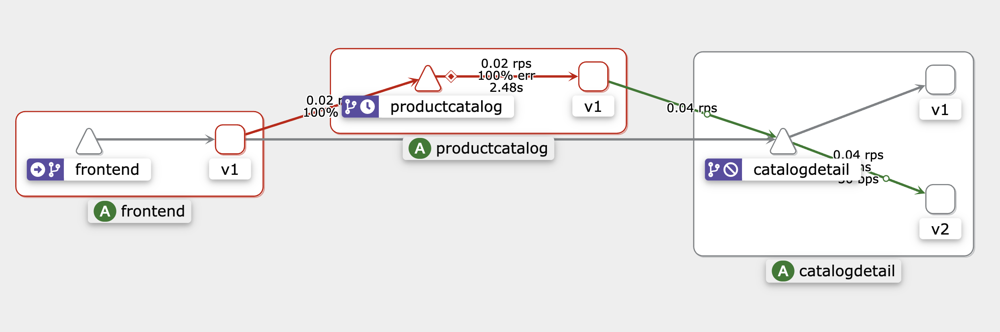
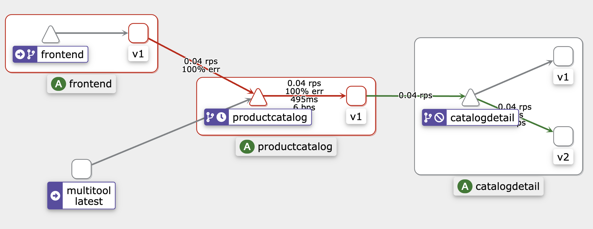

# Network Resiliency - Timeouts/Retries/Circuit Breaking

This sub-module will cover the network resiliency and testing features such as **Timeouts, Retries and Circuit Breaking** of Istio service-mesh on Amazon EKS. 

Use the following links to quickly jump to the desired section:
1. [Timeouts](#timeouts)
2. [Retries](#retries)
3. [Circuit-Breaking](#circuit-breaking)

## Prerequisites:
1. [Module 1 - Getting Started](../01-getting-started/)
2. [Install `istioctl` and add it to the $PATH](https://istio.io/latest/docs/ops/diagnostic-tools/istioctl/#install-hahahugoshortcode860s2hbhb)

>Note: This module will build on the application resources deployed in 
[Module 1 - Getting Started](../01-getting-started/). That means you **don't** have to execute the [Destroy](../01-getting-started/README.md#destroy) section in Module 1.

## Initial state setup
  
In this step we add the Istio mesh resources to wrap the `frontend`, `productcatalog` and
`catalogdetail` services.

A [`DestinationRule`](https://istio.io/latest/docs/reference/config/networking/destination-rule/) is created for [`catalogdetail`](./setup-mesh-resources/catalogdetail-destinationrule.yaml) to select subsets
based on the `version` label of the destination pods. However, the initial [`VirtualService`](./setup-mesh-resources/catalogdetail-virtualservice.yaml) definition does not specify any 
subset configuration thereby leading to a uniform traffic spread across both subsets.

```bash
# This assumes that you are currently in "istio-on-eks/modules/01-getting-started" folder
cd ../03-network-resiliency/timeouts-retries-circuitbreaking

# Install the mesh resources
kubectl apply -f ./setup-mesh-resources/
```

Output should be similar to:

```
destinationrule.networking.istio.io/catalogdetail created
virtualservice.networking.istio.io/catalogdetail created
virtualservice.networking.istio.io/frontend created
virtualservice.networking.istio.io/productcatalog created
```

## Timeouts

To test the timeout functionality we will make the following two changes:
1. Add a `delay` of `5` seconds to the `catalogdetail` VirtualService
2. Add a `timeout` of `2` seconds to the `productcatalog` VirtualService

Since the `productcatalog` service calls the `catalogdetail` service and since 
`catalogdetail` will take about `5` seconds to respond, we will get to see the 
timeouts getting triggered.

### Testing 

#### Testing Delays

Apply the delay configuration to the `catalogdetail` VirtualService

```sh
kubectl apply -f ./timeouts/catalogdetail-virtualservice.yaml
```

Test for the delay in accessing the application:

```sh  
export ISTIO_INGRESS_URL=$(kubectl get service/istio-ingress -n istio-ingress -o json | jq -r '.status.loadBalancer.ingress[0].hostname')

curl $ISTIO_INGRESS_URL -s -o /dev/null -w  "%{time_starttransfer}\n"
```
If the delay configuration is applied correctly, the output should be similar to:

```
5.022975
```

#### Testing Timeouts

Apply the timeout configuration to the `productcatalog` VirtualService

```sh
kubectl apply -f ./timeouts/productcatalog-virtualservice.yaml
```

Test the timeout by running a `curl` command against the `productcatalog` service 
from within the mesh.

```sh  
# Create a multitool pod just to be able to use curl from within the mesh
kubectl run multitool --image=praqma/network-multitool -n workshop

# Wait for the pod to be created
sleep 5

kubectl exec -n workshop -t multitool -- \
curl http://productcatalog:5000/products/ -s -o /dev/null \
-w "Time taken to start transfer: %{time_starttransfer}\n"
```
Output should be similar to:

```
pod/multitool created
Time taken to start transfer: 2.006628
```



### Reset the environment

Delete the `multitool` pod with the command shown below and then run the same 
steps as in the [Initial state setup](#initial-state-setup) to reset the 
environment for testing the remaining features.

```sh
kubectl delete pod multitool -n workshop
```

## Retries:

To test the retries functionality we will make the following changes:
1. Add configuration for `retries` with `2` attempts to the `productcatalog` 
VirtualService
2. Edit the `productcatalog` deployment to run a container that does nothing other 
than to sleep for 1 hour. To achieve this we make the following changes to the 
deployment:
   * Change the `readinessProbe` to run a simple command `echo hello`. Since the  
   command always succeeds, the container would immediately be ready.
   * Change the `livenessProbe` to run a simple command `echo hello`.  Since the  
   command always succeeds, the container is immediately marked to be live.
   * Add a `command` to the container that will cause the main process to sleep
   for 1 hour

To apply these changes, run the following command:

```sh 
kubectl apply -f ./retries/

kubectl get deployment -n workshop productcatalog -o json |
jq '.spec.template.spec.containers[0].readinessProbe={exec:{command:["sh","-c","echo hello"]}}
| .spec.template.spec.containers[0].livenessProbe={exec:{command:["sh","-c","echo hello"]}}
| .spec.template.spec.containers[0]+={command:["sh","-c","sleep 1h"]}' |
kubectl apply --force=true -f -
```

### Testing 

Enable `debug` mode for the envoy logs of `productcatalog` service with the 
command below:

```sh
istioctl pc log --level debug -n workshop deploy/productcatalog
```

#### Testing Retries

Refresh the browser and look at the logs to see the number of retries 

```sh
kubectl -n workshop logs -l app=productcatalog -c istio-proxy -f | 
grep "x-envoy-attempt-count"
```

Output should be similar: 

``` 
'x-envoy-attempt-count', '1'
'x-envoy-attempt-count', '1'
'x-envoy-attempt-count', '2'
'x-envoy-attempt-count', '2'
'x-envoy-attempt-count', '3'
'x-envoy-attempt-count', '3'
```

We see `3` attempt counts as, in addition to `2` retries, it also includes the 
very first attempt at connecting to the service.



### Reset the environment

Reset the `productcatalog` deployment with the following instructions and then 
run the same steps as in the [Initial state setup](#initial-state-setup) to reset 
the environment for testing the remaining features.

```sh 
kubectl delete deployment -n workshop productcatalog
helm upgrade mesh-basic ../../01-getting-started/ -n workshop
```

## Circuit Breaking

To test the circuit-breaker functionality we will make the following changes:
1. Modify the existing `catalogdetail` destination rule to apply circuit breaking
configuration

```sh
kubectl apply -f ./circuitbreaking/
```

### Testing

To be able to test the circuit breaker feature we will use an application called 
[`fortio`](https://github.com/fortio/fortio) and to do this we will run a pod 
with a single container based on the `fortio` image.

Run the command below to create a `fortio` pod in the workshop namespace:

```sh
kubectl run fortio --image=fortio/fortio:latest_release -n workshop --annotations='proxy.istio.io/config=proxyStatsMatcher:
  inclusionPrefixes:
  - "cluster.outbound"
  - "cluster_manager"
  - "listener_manager"
  - "server"
  - "cluster.xds-grpc"'
```

Now from within the `fortio` pod test out a single `curl` to the `catalogdetail` 
service:

```sh
kubectl exec fortio -n workshop -c fortio -- /usr/bin/fortio \
curl http://catalogdetail.workshop.svc.cluster.local:3000/catalogDetail
```

Output should be similar to below:

```
{"ts":1704746733.172561,"level":"info","r":1,"file":"scli.go","line":123,"msg":"Starting","command":"Φορτίο","version":"1.60.3 h1:adR0uf/69M5xxKaMLAautVf9FIVkEpMwuEWyMaaSnI0= go1.20.10 amd64 linux"}
HTTP/1.1 200 OK
x-powered-by: Express
content-type: application/json; charset=utf-8
content-length: 37
etag: W/"25-+DP7kANx3olb0HJqt5zDWgaO2Gg"
date: Mon, 08 Jan 2024 20:45:33 GMT
x-envoy-upstream-service-time: 8
server: envoy

{"version":"1","vendors":["ABC.com"]}%    
```

### Tripping the circuit breaker

We can start testing the circuit breaking functionality by generating traffic to
the `catalogdetail` service with two concurrent connections (-c 2) and by sending
a total of 20 requests (-n 20):

```sh
kubectl exec fortio -n workshop -c fortio -- \
/usr/bin/fortio load -c 2 -qps 0 -n 20 -loglevel Warning \
http://catalogdetail.workshop.svc.cluster.local:3000/catalogDetail
``` 
Output should be similar to below:

```
{"ts":1704746942.859803,"level":"info","r":1,"file":"logger.go","line":254,"msg":"Log level is now 3 Warning (was 2 Info)"}
Fortio 1.60.3 running at 0 queries per second, 2->2 procs, for 20 calls: http://catalogdetail.workshop.svc.cluster.local:3000/catalogDetail
Starting at max qps with 2 thread(s) [gomax 2] for exactly 20 calls (10 per thread + 0)
{"ts":1704746942.889725,"level":"warn","r":13,"file":"http_client.go","line":1104,"msg":"Non ok http code","code":503,"status":"HTTP/1.1 503","thread":1,"run":0}
{"ts":1704746942.895346,"level":"warn","r":12,"file":"http_client.go","line":1104,"msg":"Non ok http code","code":503,"status":"HTTP/1.1 503","thread":0,"run":0}
{"ts":1704746942.912859,"level":"warn","r":13,"file":"http_client.go","line":1104,"msg":"Non ok http code","code":503,"status":"HTTP/1.1 503","thread":1,"run":0}
{"ts":1704746942.918274,"level":"warn","r":12,"file":"http_client.go","line":1104,"msg":"Non ok http code","code":503,"status":"HTTP/1.1 503","thread":0,"run":0}
{"ts":1704746942.927350,"level":"warn","r":13,"file":"http_client.go","line":1104,"msg":"Non ok http code","code":503,"status":"HTTP/1.1 503","thread":1,"run":0}
Ended after 65.360704ms : 20 calls. qps=305.99
Aggregated Function Time : count 20 avg 0.0063910061 +/- 0.003646 min 0.000391494 max 0.013544634 sum 0.127820122
# range, mid point, percentile, count
>= 0.000391494 <= 0.001 , 0.000695747 , 15.00, 3
> 0.003 <= 0.004 , 0.0035 , 25.00, 2
> 0.004 <= 0.005 , 0.0045 , 30.00, 1
> 0.005 <= 0.006 , 0.0055 , 45.00, 3
> 0.006 <= 0.007 , 0.0065 , 65.00, 4
> 0.007 <= 0.008 , 0.0075 , 70.00, 1
> 0.008 <= 0.009 , 0.0085 , 75.00, 1
> 0.009 <= 0.01 , 0.0095 , 85.00, 2
> 0.011 <= 0.012 , 0.0115 , 90.00, 1
> 0.012 <= 0.0135446 , 0.0127723 , 100.00, 2
# target 50% 0.00625
# target 75% 0.009
# target 90% 0.012
# target 99% 0.0133902
# target 99.9% 0.0135292
Error cases : count 5 avg 0.001746463 +/- 0.001537 min 0.000391494 max 0.003912496 sum 0.008732315
# range, mid point, percentile, count
>= 0.000391494 <= 0.001 , 0.000695747 , 60.00, 3
> 0.003 <= 0.0039125 , 0.00345625 , 100.00, 2
# target 50% 0.000847874
# target 75% 0.00334219
# target 90% 0.00368437
# target 99% 0.00388968
# target 99.9% 0.00391021
# Socket and IP used for each connection:
[0]   3 socket used, resolved to 172.20.233.48:3000, connection timing : count 3 avg 8.8641667e-05 +/- 1.719e-05 min 6.4519e-05 max 0.000103303 sum 0.000265925
[1]   3 socket used, resolved to 172.20.233.48:3000, connection timing : count 3 avg 0.000145408 +/- 7.262e-05 min 8.4711e-05 max 0.000247501 sum 0.000436224
Connection time (s) : count 6 avg 0.00011702483 +/- 5.992e-05 min 6.4519e-05 max 0.000247501 sum 0.000702149
Sockets used: 6 (for perfect keepalive, would be 2)
Uniform: false, Jitter: false, Catchup allowed: true
IP addresses distribution:
172.20.233.48:3000: 6
Code 200 : 15 (75.0 %)
Code 503 : 5 (25.0 %)
Response Header Sizes : count 20 avg 177.75 +/- 102.6 min 0 max 237 sum 3555
Response Body/Total Sizes : count 20 avg 268.9 +/- 16.57 min 241 max 283 sum 5378
All done 20 calls (plus 0 warmup) 6.391 ms avg, 306.0 qps
```

We can notice that most requests have been successful except for few. The istio-proxy 
does allow for some leeway.

```
Code 200 : 17 (85.0 %)
Code 503 : 3 (15.0 %)
```

Now rerun the same command by increasing the number of concurrent connections to 3
and number of calls to 30

```sh
kubectl exec fortio -n workshop -c fortio -- \
/usr/bin/fortio load -c 3 -qps 0 -n 30 -loglevel Warning \
http://catalogdetail.workshop.svc.cluster.local:3000/catalogDetail
``` 
Output should be similar to below:

```
{"ts":1704747392.512409,"level":"info","r":1,"file":"logger.go","line":254,"msg":"Log level is now 3 Warning (was 2 Info)"}
Fortio 1.60.3 running at 0 queries per second, 2->2 procs, for 30 calls: http://catalogdetail.workshop.svc.cluster.local:3000/catalogDetail
Starting at max qps with 3 thread(s) [gomax 2] for exactly 30 calls (10 per thread + 0)
{"ts":1704747392.520178,"level":"warn","r":28,"file":"http_client.go","line":1104,"msg":"Non ok http code","code":503,"status":"HTTP/1.1 503","thread":1,"run":0}
{"ts":1704747392.520799,"level":"warn","r":29,"file":"http_client.go","line":1104,"msg":"Non ok http code","code":503,"status":"HTTP/1.1 503","thread":2,"run":0}
{"ts":1704747392.523468,"level":"warn","r":29,"file":"http_client.go","line":1104,"msg":"Non ok http code","code":503,"status":"HTTP/1.1 503","thread":2,"run":0}
{"ts":1704747392.525391,"level":"warn","r":29,"file":"http_client.go","line":1104,"msg":"Non ok http code","code":503,"status":"HTTP/1.1 503","thread":2,"run":0}
{"ts":1704747392.527484,"level":"warn","r":27,"file":"http_client.go","line":1104,"msg":"Non ok http code","code":503,"status":"HTTP/1.1 503","thread":0,"run":0}
{"ts":1704747392.528848,"level":"warn","r":27,"file":"http_client.go","line":1104,"msg":"Non ok http code","code":503,"status":"HTTP/1.1 503","thread":0,"run":0}
{"ts":1704747392.531731,"level":"warn","r":28,"file":"http_client.go","line":1104,"msg":"Non ok http code","code":503,"status":"HTTP/1.1 503","thread":1,"run":0}
{"ts":1704747392.533632,"level":"warn","r":28,"file":"http_client.go","line":1104,"msg":"Non ok http code","code":503,"status":"HTTP/1.1 503","thread":1,"run":0}
{"ts":1704747392.534727,"level":"warn","r":29,"file":"http_client.go","line":1104,"msg":"Non ok http code","code":503,"status":"HTTP/1.1 503","thread":2,"run":0}
{"ts":1704747392.536192,"level":"warn","r":29,"file":"http_client.go","line":1104,"msg":"Non ok http code","code":503,"status":"HTTP/1.1 503","thread":2,"run":0}
{"ts":1704747392.538116,"level":"warn","r":29,"file":"http_client.go","line":1104,"msg":"Non ok http code","code":503,"status":"HTTP/1.1 503","thread":2,"run":0}
{"ts":1704747392.539070,"level":"warn","r":27,"file":"http_client.go","line":1104,"msg":"Non ok http code","code":503,"status":"HTTP/1.1 503","thread":0,"run":0}
{"ts":1704747392.541580,"level":"warn","r":29,"file":"http_client.go","line":1104,"msg":"Non ok http code","code":503,"status":"HTTP/1.1 503","thread":2,"run":0}
{"ts":1704747392.543714,"level":"warn","r":29,"file":"http_client.go","line":1104,"msg":"Non ok http code","code":503,"status":"HTTP/1.1 503","thread":2,"run":0}
{"ts":1704747392.545742,"level":"warn","r":29,"file":"http_client.go","line":1104,"msg":"Non ok http code","code":503,"status":"HTTP/1.1 503","thread":2,"run":0}
{"ts":1704747392.550258,"level":"warn","r":27,"file":"http_client.go","line":1104,"msg":"Non ok http code","code":503,"status":"HTTP/1.1 503","thread":0,"run":0}
{"ts":1704747392.554057,"level":"warn","r":28,"file":"http_client.go","line":1104,"msg":"Non ok http code","code":503,"status":"HTTP/1.1 503","thread":1,"run":0}
{"ts":1704747392.560066,"level":"warn","r":28,"file":"http_client.go","line":1104,"msg":"Non ok http code","code":503,"status":"HTTP/1.1 503","thread":1,"run":0}
Ended after 50.285039ms : 30 calls. qps=596.6
Aggregated Function Time : count 30 avg 0.0039136975 +/- 0.003494 min 0.00032006 max 0.011210633 sum 0.117410925
# range, mid point, percentile, count
>= 0.00032006 <= 0.001 , 0.00066003 , 26.67, 8
> 0.001 <= 0.002 , 0.0015 , 40.00, 4
> 0.002 <= 0.003 , 0.0025 , 56.67, 5
> 0.003 <= 0.004 , 0.0035 , 60.00, 1
> 0.004 <= 0.005 , 0.0045 , 63.33, 1
> 0.005 <= 0.006 , 0.0055 , 76.67, 4
> 0.007 <= 0.008 , 0.0075 , 80.00, 1
> 0.008 <= 0.009 , 0.0085 , 86.67, 2
> 0.009 <= 0.01 , 0.0095 , 93.33, 2
> 0.01 <= 0.011 , 0.0105 , 96.67, 1
> 0.011 <= 0.0112106 , 0.0111053 , 100.00, 1
# target 50% 0.0026
# target 75% 0.005875
# target 90% 0.0095
# target 99% 0.0111474
# target 99.9% 0.0112043
Error cases : count 18 avg 0.001365681 +/- 0.0008843 min 0.00032006 max 0.003261174 sum 0.024582258
# range, mid point, percentile, count
>= 0.00032006 <= 0.001 , 0.00066003 , 44.44, 8
> 0.001 <= 0.002 , 0.0015 , 66.67, 4
> 0.002 <= 0.003 , 0.0025 , 94.44, 5
> 0.003 <= 0.00326117 , 0.00313059 , 100.00, 1
# target 50% 0.00125
# target 75% 0.0023
# target 90% 0.00284
# target 99% 0.00321416
# target 99.9% 0.00325647
# Socket and IP used for each connection:
[0]   5 socket used, resolved to 172.20.233.48:3000, connection timing : count 5 avg 0.0001612534 +/- 8.84e-05 min 8.515e-05 max 0.000330062 sum 0.000806267
[1]   5 socket used, resolved to 172.20.233.48:3000, connection timing : count 5 avg 0.000214197 +/- 0.0002477 min 5.6614e-05 max 0.00070467 sum 0.001070985
[2]   9 socket used, resolved to 172.20.233.48:3000, connection timing : count 9 avg 0.00011278589 +/- 5.424e-05 min 6.4739e-05 max 0.000243749 sum 0.001015073
Connection time (s) : count 19 avg 0.00015222763 +/- 0.0001462 min 5.6614e-05 max 0.00070467 sum 0.002892325
Sockets used: 19 (for perfect keepalive, would be 3)
Uniform: false, Jitter: false, Catchup allowed: true
IP addresses distribution:
172.20.233.48:3000: 19
Code 200 : 12 (40.0 %)
Code 503 : 18 (60.0 %)
Response Header Sizes : count 30 avg 94.8 +/- 116.1 min 0 max 237 sum 2844
Response Body/Total Sizes : count 30 avg 256 +/- 18.59 min 241 max 283 sum 7680
All done 30 calls (plus 0 warmup) 3.914 ms avg, 596.6 qps
```
As we increase the traffic towards the `catalogdetail` microservice we start to 
notice the circuit breaking functionality kicking in. We now notice that  only 
40% of the requests succeeded and the rest 60%, as expected, were trapped 
by circuit breaker.

```
Code 200 : 12 (40.0 %)
Code 503 : 18 (60.0 %)
```
Now, query the isto-proxy to see the stats of the requests flagged for circuitbreaking.

```sh
kubectl exec fortio -n workshop -c istio-proxy -- pilot-agent request GET stats | grep catalogdetail | grep pending
```

```
cluster.outbound|3000|v1|catalogdetail.workshop.svc.cluster.local.circuit_breakers.default.remaining_pending: 1
cluster.outbound|3000|v1|catalogdetail.workshop.svc.cluster.local.circuit_breakers.default.rq_pending_open: 0
cluster.outbound|3000|v1|catalogdetail.workshop.svc.cluster.local.circuit_breakers.high.rq_pending_open: 0
cluster.outbound|3000|v1|catalogdetail.workshop.svc.cluster.local.upstream_rq_pending_active: 0
cluster.outbound|3000|v1|catalogdetail.workshop.svc.cluster.local.upstream_rq_pending_failure_eject: 0
cluster.outbound|3000|v1|catalogdetail.workshop.svc.cluster.local.upstream_rq_pending_overflow: 0
cluster.outbound|3000|v1|catalogdetail.workshop.svc.cluster.local.upstream_rq_pending_total: 0
cluster.outbound|3000|v2|catalogdetail.workshop.svc.cluster.local.circuit_breakers.default.remaining_pending: 1
cluster.outbound|3000|v2|catalogdetail.workshop.svc.cluster.local.circuit_breakers.default.rq_pending_open: 0
cluster.outbound|3000|v2|catalogdetail.workshop.svc.cluster.local.circuit_breakers.high.rq_pending_open: 0
cluster.outbound|3000|v2|catalogdetail.workshop.svc.cluster.local.upstream_rq_pending_active: 0
cluster.outbound|3000|v2|catalogdetail.workshop.svc.cluster.local.upstream_rq_pending_failure_eject: 0
cluster.outbound|3000|v2|catalogdetail.workshop.svc.cluster.local.upstream_rq_pending_overflow: 0
cluster.outbound|3000|v2|catalogdetail.workshop.svc.cluster.local.upstream_rq_pending_total: 0
cluster.outbound|3000||catalogdetail.workshop.svc.cluster.local.circuit_breakers.default.remaining_pending: 1
cluster.outbound|3000||catalogdetail.workshop.svc.cluster.local.circuit_breakers.default.rq_pending_open: 0
cluster.outbound|3000||catalogdetail.workshop.svc.cluster.local.circuit_breakers.high.rq_pending_open: 0
cluster.outbound|3000||catalogdetail.workshop.svc.cluster.local.upstream_rq_pending_active: 0
cluster.outbound|3000||catalogdetail.workshop.svc.cluster.local.upstream_rq_pending_failure_eject: 0
cluster.outbound|3000||catalogdetail.workshop.svc.cluster.local.upstream_rq_pending_overflow: 17
cluster.outbound|3000||catalogdetail.workshop.svc.cluster.local.upstream_rq_pending_total: 34
```

upstream_rq_pending_overflow is having value as 17, which means 17 calls so far have been flagged for circuitbreaking.  


### Reset the environment

Delete the `fortio` pod using the following command and then run the same steps 
as in the [Initial state setup](#initial-state-setup) to reset the environment 
one last time.

```sh 
kubectl delete pod fortio -n workshop
```
