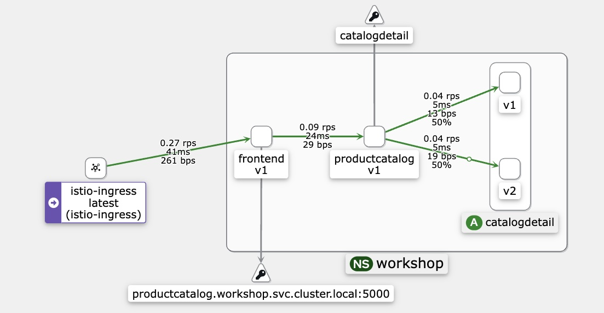
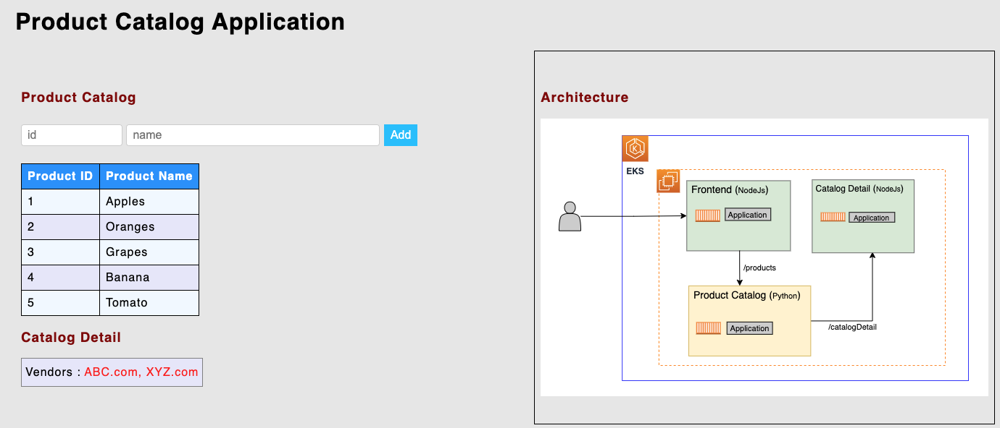
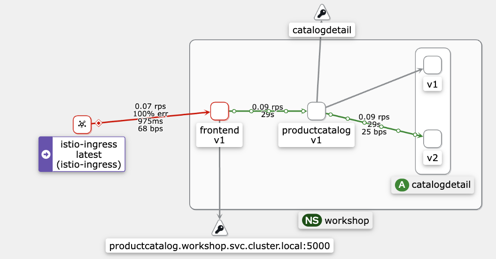

# Module 4 - Fault Injection

This module shows the fault injection capabilities of Istio service-mesh on Amazon EKS. 

## Prerequisites:
- [Module 1 - Getting Started](../01-getting-started/)

Note: This module will build on the application resources deployed in 
[Module 1 - Getting Started](../01-getting-started/). That means you **don't** have to execute the [Destroy](../01-getting-started/README.md#destroy) section in Module 1.

## Initial state setup

In this step we add the Istio mesh resources to wrap the `frontend`, `productcatalog` and
`catalogdetail` services.

A [`VirtualService`](https://istio.io/latest/docs/reference/config/networking/virtual-service/) [`virtual-service-all`](./virtual-service-all.yaml) defines the configuration along with subsets for each `frontend` (v1), `productcatalog` (v2) and `catalogdetail` (v1 & v2) services. Also a [`DestinationRule`](https://istio.io/latest/docs/reference/config/networking/destination-rule/) is created for all the services [`destination-rule-all`](./destination-rule-all.yaml)(./destination-rule-all.yaml) to select subsets based on the `version` label of the destination pods. 

### Deploy 

```bash
# Change directory to the right folder
cd ../04-fault-injection

# Apply virtual services & destination rule configuration
kubectl apply -f ./virtual-service-all.yaml
kubectl apply -f ./destination-rule-all.yaml 
```

Output should be similar to:
```bash
virtualservice.networking.istio.io/frontend created
virtualservice.networking.istio.io/productcatalog created
virtualservice.networking.istio.io/catalogdetail created
destinationrule.networking.istio.io/frontend created
destinationrule.networking.istio.io/productcatalog created
destinationrule.networking.istio.io/catalogdetail created
```

Kiali Dashboard : 


>Note : As you can notice on the Kiali Dashboard (Graph View) the Virtual Service and Destination Rules are applied and the traffic flows from frontend-v1 service to productcatalog-v1 service and from there 50% of traffic flows to catalogdetail-v1 and the other 50% to catalogdetail-v2. Please refer to [01-getting-started](https://github.com/aws-samples/istio-on-eks/tree/main/modules/01-getting-started) as well for Kiali setup and configuration.

### Simulating Latency : HTTP Delay Fault Injection

Create a fault injection rule to delay traffic coming to catalogdetail service v1

```
kubectl apply -f virtual-service-catalogdetail-test-delay.yaml 
```

The contents of the file are as follows:

```
apiVersion: networking.istio.io/v1alpha3
kind: VirtualService
metadata:
  name: catalogdetail
  namespace: workshop
spec:
  hosts:
  - catalogdetail
  http:
  - fault:
      delay:
        percentage:
          value: 100
        fixedDelay: 15s
    route:
    - destination:
        host: catalogdetail
        subset: v2
```

>The `fault` field in a VirtualService configuration is used to inject faults into the traffic that is routed to the `catalogdetail` service. The `delay` fault injects a delay into the traffic before it is forwarded to the service. The delay can be specified as a fixed amount of time or as a percentage of requests. The `percentage` value in the configuration provided indicates that the delay will be applied to 100% of requests to the `catalogdetail` service. The `fixedDelay` value of 15s indicates that the delay will be 15 seconds. The `route`, and `destination` configuration indicates that the traffic will be routed to `catalogdetail-v2` when the delay is introduced on `catalogdetail` application.

Expected Output:

```
virtualservice.networking.istio.io/catalogdetail configured
```

#### Validation

Confirm the rule was created : 

```
kubectl get virtualservice catalogdetail -o yaml -n workshop
```

Allow few seconds for the new rule to propagate to all pods. Following which you should see the output something in line to below

```
apiVersion: networking.istio.io/v1beta1
kind: VirtualService
...
spec:
  hosts:
  - catalogdetail
  http:
  - fault:
      delay:
        fixedDelay: 15s
        percentage:
          value: 100
    route:
    - destination:
        host: catalogdetail
        subset: v2
```

#### Verifying the delay configuration

* Open the Product Catalog web application in your browser.
* With the delay configuration in place, as illustrated below you should see the Catalog Detail resulting in `Vendors: ABC.com, XYZ.com`. This is because the `catalogdetail` service has two versions `v1 (ABC.com)` and `v2(ABC.com, XYZ.com)` and the delay in `catalogdetail` has resulted in routing the requests to `catalogdetail-v2` 


* Kiali Dashboard 

[Image: Image.jpg]

By introducing a delay for `catalogdetail` , traffic seamlessly switched to `catalogdetail` v2 without user disruption. This kind of deliberate testing helps evaluate the resiliency of the application. These kinds of issues can arise in large-scale enterprise apps with independent microservices. Istio's fault injection rules are invaluable for spotting such anomalies without affecting users.

### Interrupting Requests : HTTP Abort Fault Injection

Another way to test microservice resiliency is to introduce an HTTP abort fault. In this task, we will introduce an HTTP abort to the `catalogdetail` microservices

Create a fault injection rule to send an HTTP abort

```
kubectl apply -f virtual-service-catalogdetail-test-abort.yaml
```

Expected Output: 

```
virtualservice.networking.istio.io/catalogdetail configured
```

Confirm the rule was created

```
kubectl get virtualservice catalogdetail -o yaml
```

Expected Output: 

```
apiVersion: networking.istio.io/v1beta1
kind: VirtualService
...
spec:
  hosts:
  - catalogdetail
  http:
  - fault:
      abort:
        httpStatus: 500
        percentage:
          value: 100
    route:
    - destination:
        host: catalogdetail
        subset: v2
```

>The `fault` field in a VirtualService configuration is used to inject faults into the traffic that is routed to the service. The `abort` fault injects an abort into the traffic to `catalogdetail` service. The `percentage` value in the configuration provided indicates that the abort will be applied to 50% of requests to the `catalogdetail` service. The `httpStatus` value of 500 indicates that the client will receive a 500 Internal Server Error response. 

However, the `route` section directs the traffic to the `v2` subset of the `catalogdetail` service, regardless of whether the abort occurred or not. This means that even though an abort is injected, the request will still be sent to the `v2` subset.


Expected Output: 

```
virtualservice.networking.istio.io/catalogdetail configured
```

Confirm the rule was created

```
kubectl get virtualservice catalogdetail -o yaml -n workshop
```

Expected Output: 

```
apiVersion: networking.istio.io/v1beta1
kind: VirtualService
...
spec:
  hosts:
  - catalogdetail
  http:
  - fault:
      abort:
        httpStatus: 500
        percentage:
          value: 50
    route:
    - destination:
        host: catalogdetail
        subset: v2
```

#### Verifying the abort configuration

* Open the Product Catalog web application in your browser.
* With the abort configuration in place, as illustrated below you should see the Catalog Detail toggling resulting in `Vendors: ABC.com, XYZ.com`. This is because the `catalogdetail` service has two versions `v1 (ABC.com)` and `v2(ABC.com, XYZ.com.)` and the abort for 50% of the traffic to `catalogdetail` has resulted in routing the requests to `catalogdetail-v2`


* Kiali Dashboard 


By introducing a delay for 50% of the requests to `catalogdetail` ensured a seamless transition to `catalogdetail-v2` without any disruption to users. This kind of testing is essential for evaluating the application's resiliency. It's not uncommon for such issues to surface in large-scale enterprise applications with independent microservices. Istio's fault injection rules prove invaluable in identifying and addressing these anomalies without impacting user.

## Cleanup

```
`# ``Remove the application routing rules`
`kubectl ``delete`` ``-``f `virtual-service-all.yaml` ``-``n workshop`
`kubectl ``delete`` ``-``f destination-rule-all.yaml`` ``-``n workshop`
```