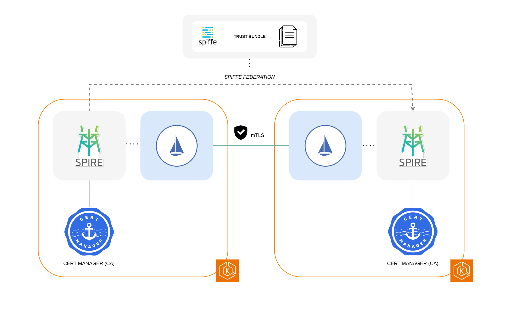

# Istio Service Mesh with Spiffe/Spire Federation between EKS clusters

## Business Use Cases and benefits for Istio Service Mesh with Spiffe/Spire federation

This pattern covers essential aspects of how to use Spiffe/Spire and Istio to bridge trust between multi-cluster Kubernetes service meshes. This allows microservices in different clusters to trust each other and communicate securely.

**Increased security:** By using Spiffe/Spire and Istio, you can ensure that only authorized workloads are able to communicate with each other. This helps to protect your microservices from unauthorized access and malicious attacks.

**Simplified management:** Spiffe/Spire and Istio provide a centralized way to manage trust policies for your microservices. This makes it easier to enforce security policies across multiple clusters.

**Improved scalability:** Spiffe/Spire and Istio are designed to scale to large deployments. This makes them a good choice for organizations that need to secure a large number of microservices.




## Prerequisites

Ensure that you have installed the following tools locally:

1. [awscli](https://docs.aws.amazon.com/cli/latest/userguide/install-cliv2.html)
2. [kubectl](https://kubernetes.io/docs/tasks/tools/)
3. [terraform](https://learn.hashicorp.com/tutorials/terraform/install-cli)
4. [istioctl](https://istio.io/latest/docs/ops/diagnostic-tools/istioctl/)

## Steps

### Download the GitHub repository on your computer

```bash
git clone https://github.com/aws-samples/istio-on-eks.git
cd istio-on-eks/patterns/eks-istio-mesh-spire-federation
```

### Create the clusters

#### Create the VPCs for the clusters and the peering between them

```bash
cd terraform/0.vpc
terraform init
terraform apply --auto-approve
```

#### Create `foo-eks-cluster`

```bash
cd ../1.foo-eks
terraform init
terraform apply --auto-approve
```

#### Create `bar-eks-cluster`

```bash
cd ../2.bar-eks
terraform init
terraform apply --auto-approve
```

Go to home folder

### Install Spire on the clusters with federation

```bash
./spire/install-spire.sh
```

### Install Istio on the clusters

**Note**: You will need EKS API endpoints from terraform outputs


`istioctl` needs to be in the PATH

```bash
./istio/install-istio.sh <cluster_endpoint_foo> <cluster_endpoint_bar>
```

### Deploy `helloworld` on both clusters and check federation

```bash
./examples/deploy-heloworld.sh
```

Curl `helloworld` endpoint to see if they are up. It should respond from both clusters

```bash
kubectl exec --context="${CTX_CLUSTER1}" -n sleep -c sleep \
    "$(kubectl get pod --context="${CTX_CLUSTER1}" -n sleep -l \
    app=sleep -o jsonpath='{.items[0].metadata.name}')" \
    -- sh -c "while :; do curl -sS helloworld.helloworld:5000/hello; sleep 1; done"
```

Scale down to 0 the helloworld-v1 and create a Gateway and a Virtual Service for `helloworld` on `eks-bar-cluster`

```bash
kubectl -n helloworld scale deploy helloworld-v1 --context="${CTX_CLUSTER1}" --replicas 0

sleep 2

kubectl apply --context="${CTX_CLUSTER2}" \
    -f ./examples/helloworld-gateway.yaml -n helloworld

export INGRESS_NAME=istio-ingressgateway
export INGRESS_NS=istio-system

GATEWAY_URL=$(kubectl -n "$INGRESS_NS" --context="${CTX_CLUSTER2}" get service "$INGRESS_NAME" -o jsonpath='{.status.loadBalancer.ingress[0].hostname}')
```

Check the service by calling the Virtual Service from the foo cluster

```bash
kubectl exec --context="${CTX_CLUSTER1}" -n sleep -c sleep \
    "$(kubectl get pod --context="${CTX_CLUSTER1}" -n sleep -l \
    app=sleep -o jsonpath='{.items[0].metadata.name}')" \
    -- sh -c "while :; do curl -s http://$GATEWAY_URL/hello; sleep 1; done"
```

### Deploy bookinfo app

```bash
./istio/deploy-bookinfo.sh
```

### View the certificate trust chain for the productpage pod

```bash
istioctl proxy-config secret deployment/productpage-v1 -o json | jq -r '.dynamicActiveSecrets[0].secret.tlsCertificate.certificateChain.inlineBytes' | base64 --decode > chain.pem
```

Open the `chain.pem` file with a text editor, and you will see two certificates. Save the two certificates in separate files and use the openssl command `openssl x509 -noout -text -in $FILE` to parse the certificate contents.

### Setting up Automatic Certificate Rotation

Modify the rotation period for istiod certificates from 60 days (1440 hours) to 30 days (720 hours), run the following command:

```bash
kubectl -f ./cert-manager/cert-rotation.yaml --context $CTX_CLUSTER1
```

Check `istiod` logs

```bash
kubectl logs -l app=istiod -n istio-system -f
```

### Cleanup

Uninstall Istio on both clusters

```bash
./istio/cleanup-istio.sh
```

Uninstall Spire on both clusters

```bash
./spire/cleanup-spire.sh
```

Uninstall EKS clusters

```bash
cd terraform/1.foo-eks
terraform destroy --auto-approve

cd ../2.bar-eks
terraform destroy --auto-approve

cd ../0.vpc
terraform destroy --auto-approve
```
