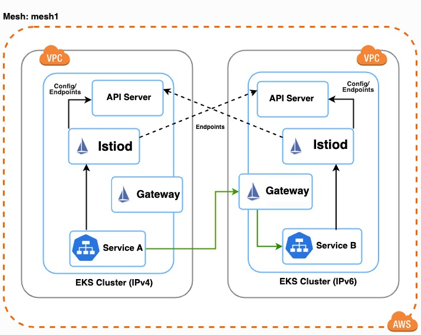
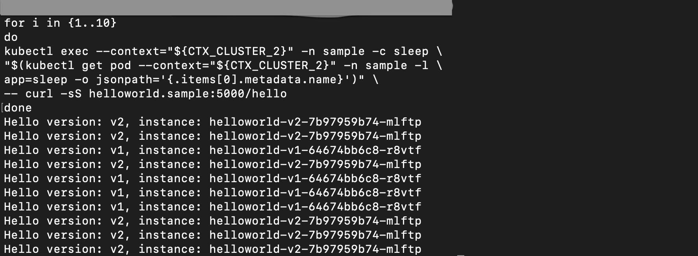

# Istio multi-network, multi-primary on EKS

This repository demonstrates how to deploy Istio in a multi-network, multi-primary configuration on Amazon EKS. It showcases Istio's capability to manage service meshes across different network environments, ideal for multi-cloud or hybrid cloud scenarios. The setup includes:

* Two separate Amazon VPCs:
  * VPC 1 (network1) for Cluster-1
  * VPC 2 (network2) for Cluster-2
   
* Two Amazon EKS clusters with different IP protocols:
  * Cluster-1: Primary cluster in network1, using IPv4
  * Cluster-2: Primary cluster in network2, using IPv6
  



## Prerequisites

Ensure that you have installed the following tools locally:

1. [awscli](https://docs.aws.amazon.com/cli/latest/userguide/install-cliv2.html)
2. [kubectl](https://kubernetes.io/docs/tasks/tools/)
3. [terraform](https://learn.hashicorp.com/tutorials/terraform/install-cli)
4. [istioctl](https://istio.io/latest/docs/ops/diagnostic-tools/istioctl/)

## Deploy 

To deploy the terraform repo, run the commands shown below:
```sh 
./scripts/deploy.sh 
```

## Validation and Testing

* Validate the deployed components
    * Set the context for both clusters using the following commands: 
        ```shell
        export CLUSTER_1=cluster-1
        export CLUSTER_2=cluster-2
        export AWS_DEFAULT_REGION=$(aws configure get region)
        export AWS_ACCOUNT_NUMBER=$(aws sts get-caller-identity --query "Account" --output text)
        
        aws eks update-kubeconfig --name $CLUSTER_1 --region $AWS_DEFAULT_REGION
        aws eks update-kubeconfig --name $CLUSTER_2 --region $AWS_DEFAULT_REGION
        
        export CTX_CLUSTER_1=arn:aws:eks:$AWS_DEFAULT_REGION:${AWS_ACCOUNT_NUMBER}:cluster/$CLUSTER_1
        export CTX_CLUSTER_2=arn:aws:eks:$AWS_DEFAULT_REGION:${AWS_ACCOUNT_NUMBER}:cluster/$CLUSTER_2
        ```
    * Check the worker nodes on each cluster using the following command: 
        ```shell
        kubectl get nodes -o wide --context=$CTX_CLUSTER_1
        
        kubectl get nodes -o wide --context=$CTX_CLUSTER_2
        ```
    * Check Istio components running on the istio-system namespace
        ```shell
        kubectl get pods,svc -n istio-system --context=$CTX_CLUSTER_1
        
        kubectl get pods,svc -n istio-system --context=$CTX_CLUSTER_2
        ```
    * Set the flags to enable PODs in an IPv4 cluster support IPv6 egress and vice versa
        
        Run this command to set ENABLE_V6_EGRESS flag on Cluster-1: 
        ```shell
        kubectl patch daemonset aws-node -n kube-system -p '{"spec": {"template": {"spec": {"initContainers": [{"env":[{"name":"ENABLE_V6_EGRESS","value":"true"}],"name":"aws-vpc-cni-init"}]}}}}' --context=$CTX_CLUSTER_1
        ```
        
        Run this command to set ENABLE_V4_EGRESS flag on Cluster-2:
        ```shell
        kubectl patch daemonset aws-node -n kube-system -p '{"spec": {"template": {"spec": {"initContainers": [{"env":[{"name":"ENABLE_V4_EGRESS","value":"true"}],"name":"aws-vpc-cni-init"}]}}}}' --context=$CTX_CLUSTER_2
        ```

* Test cross cluster communication
    
    To verify the multi-cluster setup, follow the steps outlined in the official Istio documentation: https://istio.io/latest/docs/setup/install/multicluster/verify/
    * This guide walks you through deploying sample applications on both clusters and testing cross-cluster communication using curl commands. 
    * Review the deployed sample apps using the commands below:
        
        ```shell
        kubectl get pods,svc -n sample --context=$CTX_CLUSTER_1
        
        kubectl get pods,svc -n sample --context=$CTX_CLUSTER_2
        ```
    * Now that the sample apps are deployed, run the following command from each cluster to test the cross cluster communication
        
        From Cluster-1: 
        ```shell
        for i in {1..10}
        do
        kubectl exec --context="${CTX_CLUSTER_1}" -n sample -c curl \
        "$(kubectl get pod --context="${CTX_CLUSTER_1}" -n sample -l \
        app=curl -o jsonpath='{.items[0].metadata.name}')" \
        -- curl -sS helloworld.sample:5000/hello
        done
        ```
        
        From Cluster-2:
        ```shell
        for i in {1..10}
        do
        kubectl exec --context="${CTX_CLUSTER_2}" -n sample -c sleep \
        "$(kubectl get pod --context="${CTX_CLUSTER_2}" -n sample -l \
        app=curl -o jsonpath='{.items[0].metadata.name}')" \
        -- curl -sS helloworld.sample:5000/hello
        done
        ```
        
        Output: 
        Verify in the response the HelloWorld version should toggle between v1 and v2 similar to the image below
        


## Destroy 
```sh 
./scripts/destroy.sh 
```

## Troubleshooting

There are many things that can go wrong when deploying a complex solutions such 
as this, Istio multi-primary on different networks.

### Ordering in Terraform deployment

The ordering is important when deploying the resources with Terraform and here 
it is:
1. Deploy the VPCs and EKS clusters 
2. Deploy the `cacerts` secret in the `istio-system` namespace in both clusters
4. Deploy the control plane `istiod` in both clusters
5. Deploy the rest of the resources, including Helm Chart `multicluster-gateway-n-apps`
in both clusters. 

The `multicluster-gateway-n-apps` Helm chart includes the following key resources:
1. `Deployment`, `Service Account` and `Service` definitions for `sleep` app
2. `Deployment` and `Service` definitions for `helloworld` app
3. Static `Gateway` definition of `cross-network-gateway` in `istio-ingress` namespace 
4. Templated `Secret` definition of `istio-remote-secret-*`


