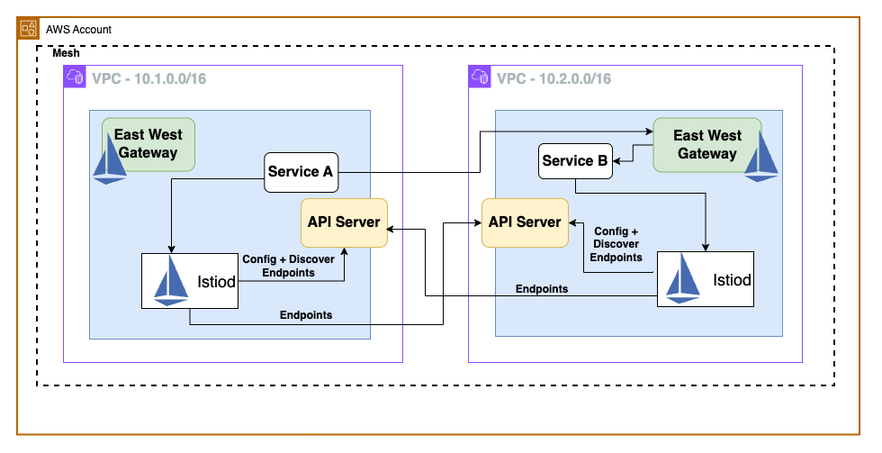

## Business Use Cases for Istio Multi-Cluster

**Fault Tolerance and High Availability:** For applications that require global reach or disaster recovery capabilities, Istio Multi-Cluster allows you to distribute your services across clusters in multiple geographic regions or availability zones enhancing resilience to failures and outages.. This improves availability, fault tolerance, and reduces latency by serving users from the nearest cluster.

**Isolation and Multitenancy:** In large organizations with multiple teams or business units, Istio Multi-Cluster allows you to isolate workloads into separate clusters while still maintaining a unified service mesh. This promotes multitenancy, security, and resource isolation between different applications or environments. It also strengthens security posture by implementing strict access controls and network segmentation, preventing unauthorized inter-service communications.

**Compliance and Regulatory Requirements:** In some industries, there may be requirements to keep certain data or workloads in specific geographic regions or environments. Istio Multi-Cluster enables you to deploy and manage applications across these isolated environments while still maintaining a unified service mesh. Istio's multi-cluster architecture ensures data segregation and compliance with regulations like GDPR and PCI DSS through Istio's multi-cluster architecture.

**Scalability, Performance and Load Balancing:** Istio Multi-Cluster achieves horizontal scaling and performance optimization by adding clusters in different regions, catering to traffic surges and reducing latency. Istio Multi-Cluster also provides load balancing across clusters, enabling you to distribute the load and avoid overloading a single cluster.

**Canary Deployments and A/B Testing:** When rolling out new versions of applications, you can use Istio Multi-Cluster to deploy the new version to a subset of clusters, allowing you to test and validate the changes before rolling them out to all clusters. This enables canary deployments and A/B testing across multiple clusters.

**Migration and Modernization:** If you're migrating applications from legacy systems to Kubernetes or modernizing your applications, Istio Multi-Cluster can help you manage the transition by allowing you to run the old and new versions of your applications in separate clusters while still maintaining connectivity and consistent policies.

